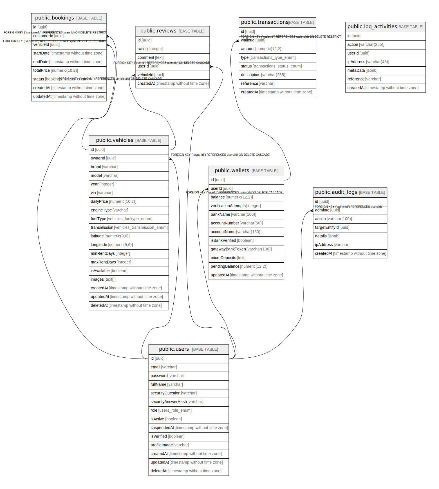

# car_lease_api

## Tables

| Name | Columns | Comment | Type |
| ---- | ------- | ------- | ---- |
| [public.users](public.users.md) | 14 |  | BASE TABLE |
| [public.vehicles](public.vehicles.md) | 19 |  | BASE TABLE |
| [public.bookings](public.bookings.md) | 9 |  | BASE TABLE |
| [public.reviews](public.reviews.md) | 6 |  | BASE TABLE |
| [public.transactions](public.transactions.md) | 8 |  | BASE TABLE |
| [public.wallets](public.wallets.md) | 12 |  | BASE TABLE |
| [public.log_activities](public.log_activities.md) | 7 |  | BASE TABLE |
| [public.audit_logs](public.audit_logs.md) | 7 |  | BASE TABLE |

## Stored procedures and functions

| Name | ReturnType | Arguments | Type |
| ---- | ------- | ------- | ---- |
| public.uuid_nil | uuid |  | FUNCTION |
| public.uuid_ns_dns | uuid |  | FUNCTION |
| public.uuid_ns_url | uuid |  | FUNCTION |
| public.uuid_ns_oid | uuid |  | FUNCTION |
| public.uuid_ns_x500 | uuid |  | FUNCTION |
| public.uuid_generate_v1 | uuid |  | FUNCTION |
| public.uuid_generate_v1mc | uuid |  | FUNCTION |
| public.uuid_generate_v3 | uuid | namespace uuid, name text | FUNCTION |
| public.uuid_generate_v4 | uuid |  | FUNCTION |
| public.uuid_generate_v5 | uuid | namespace uuid, name text | FUNCTION |

## Enums

| Name | Values |
| ---- | ------- |
| public.bookings_status_enum | ACTIVE, AWAITING_PAYMENT, CANCELLED, COMPLETED, PAID, PENDING |
| public.transactions_status_enum | FAILED, PENDING, SUCCESS |
| public.transactions_type_enum | CREDIT, DEBIT |
| public.users_role_enum | ADMIN, CAR_OWNER, CEO, CUSTOMER |
| public.vehicles_fueltype_enum | DIESEL, ELECTRIC, HYBRID, PETROL |
| public.vehicles_transmission_enum | AUTOMATIC, MANUAL |

## Relations

---

> Generated by [tbls](https://github.com/k1LoW/tbls)
