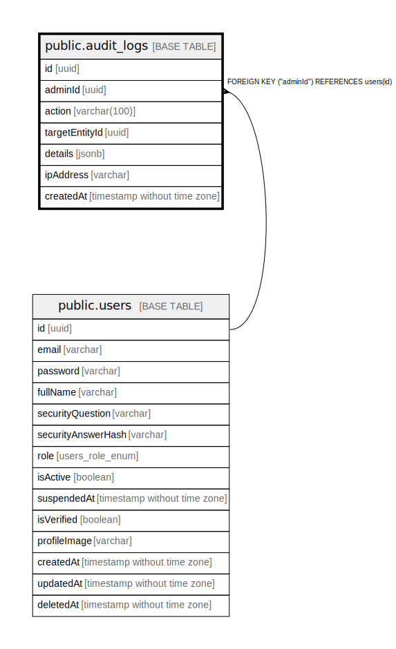

# public.audit_logs

## Columns

| Name | Type | Default | Nullable | Children | Parents | Comment |
| ---- | ---- | ------- | -------- | -------- | ------- | ------- |
| id | uuid | uuid_generate_v4() | false |  |  |  |
| adminId | uuid |  | false |  | [public.users](public.users.md) |  |
| action | varchar(100) |  | false |  |  |  |
| targetEntityId | uuid |  | true |  |  |  |
| details | jsonb |  | true |  |  |  |
| ipAddress | varchar |  | true |  |  |  |
| createdAt | timestamp without time zone | now() | false |  |  |  |

## Constraints

| Name | Type | Definition |
| ---- | ---- | ---------- |
| FK_9d53d8c4d4227c02e4476129d25 | FOREIGN KEY | FOREIGN KEY ("adminId") REFERENCES users(id) |
| PK_1bb179d048bbc581caa3b013439 | PRIMARY KEY | PRIMARY KEY (id) |

## Indexes

| Name | Definition |
| ---- | ---------- |
| PK_1bb179d048bbc581caa3b013439 | CREATE UNIQUE INDEX "PK_1bb179d048bbc581caa3b013439" ON public.audit_logs USING btree (id) |

## Relations

---

> Generated by [tbls](https://github.com/k1LoW/tbls)
