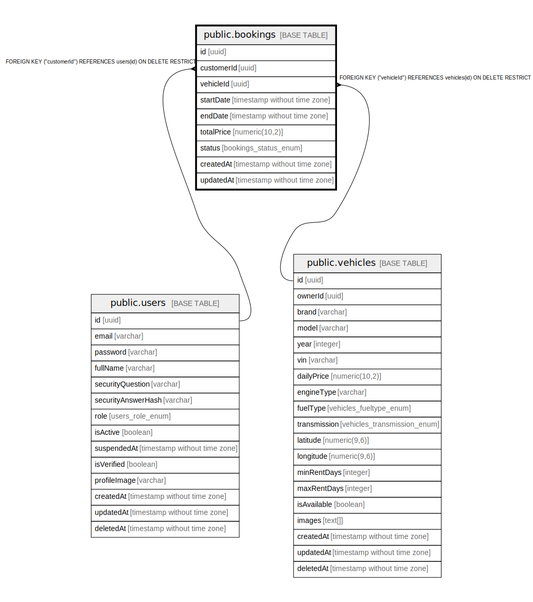

# public.bookings

## Columns

| Name | Type | Default | Nullable | Children | Parents | Comment |
| ---- | ---- | ------- | -------- | -------- | ------- | ------- |
| id | uuid | uuid_generate_v4() | false |  |  |  |
| customerId | uuid |  | false |  | [public.users](public.users.md) |  |
| vehicleId | uuid |  | false |  | [public.vehicles](public.vehicles.md) |  |
| startDate | timestamp without time zone |  | false |  |  |  |
| endDate | timestamp without time zone |  | false |  |  |  |
| totalPrice | numeric(10,2) |  | false |  |  |  |
| status | bookings_status_enum | 'PENDING'::bookings_status_enum | false |  |  |  |
| createdAt | timestamp without time zone | now() | false |  |  |  |
| updatedAt | timestamp without time zone | now() | false |  |  |  |

## Constraints

| Name | Type | Definition |
| ---- | ---- | ---------- |
| FK_67b9cd20f987fc6dc70f7cd283f | FOREIGN KEY | FOREIGN KEY ("customerId") REFERENCES users(id) ON DELETE RESTRICT |
| FK_30909e71d6dd969e95d995258f1 | FOREIGN KEY | FOREIGN KEY ("vehicleId") REFERENCES vehicles(id) ON DELETE RESTRICT |
| PK_bee6805982cc1e248e94ce94957 | PRIMARY KEY | PRIMARY KEY (id) |

## Indexes

| Name | Definition |
| ---- | ---------- |
| PK_bee6805982cc1e248e94ce94957 | CREATE UNIQUE INDEX "PK_bee6805982cc1e248e94ce94957" ON public.bookings USING btree (id) |
| IDX_48b267d894e32a25ebde4b207a | CREATE INDEX "IDX_48b267d894e32a25ebde4b207a" ON public.bookings USING btree (status) |

## Relations

---

> Generated by [tbls](https://github.com/k1LoW/tbls)
