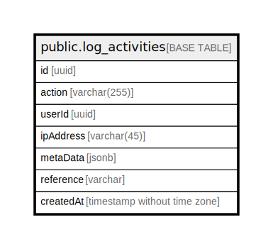

# public.log_activities

## Columns

| Name | Type | Default | Nullable | Children | Parents | Comment |
| ---- | ---- | ------- | -------- | -------- | ------- | ------- |
| id | uuid | uuid_generate_v4() | false |  |  |  |
| action | varchar(255) |  | false |  |  |  |
| userId | uuid |  | true |  |  |  |
| ipAddress | varchar(45) |  | true |  |  |  |
| metaData | jsonb |  | true |  |  |  |
| reference | varchar |  | true |  |  |  |
| createdAt | timestamp without time zone | now() | false |  |  |  |

## Constraints

| Name | Type | Definition |
| ---- | ---- | ---------- |
| PK_0d8ca6664b12f45d2c86f734c5e | PRIMARY KEY | PRIMARY KEY (id) |
| UQ_de9da7f6e0bc3f730b5dc4e178e | UNIQUE | UNIQUE (reference) |

## Indexes

| Name | Definition |
| ---- | ---------- |
| PK_0d8ca6664b12f45d2c86f734c5e | CREATE UNIQUE INDEX "PK_0d8ca6664b12f45d2c86f734c5e" ON public.log_activities USING btree (id) |
| UQ_de9da7f6e0bc3f730b5dc4e178e | CREATE UNIQUE INDEX "UQ_de9da7f6e0bc3f730b5dc4e178e" ON public.log_activities USING btree (reference) |
| IDX_de9da7f6e0bc3f730b5dc4e178 | CREATE INDEX "IDX_de9da7f6e0bc3f730b5dc4e178" ON public.log_activities USING btree (reference) |

## Relations

---

> Generated by [tbls](https://github.com/k1LoW/tbls)
