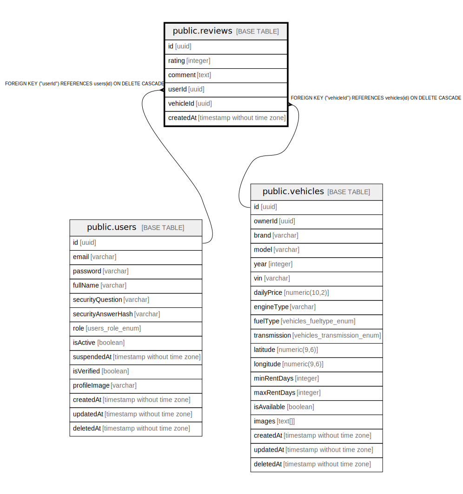

# public.reviews

## Columns

| Name | Type | Default | Nullable | Children | Parents | Comment |
| ---- | ---- | ------- | -------- | -------- | ------- | ------- |
| id | uuid | uuid_generate_v4() | false |  |  |  |
| rating | integer |  | false |  |  |  |
| comment | text |  | true |  |  |  |
| userId | uuid |  | false |  | [public.users](public.users.md) |  |
| vehicleId | uuid |  | false |  | [public.vehicles](public.vehicles.md) |  |
| createdAt | timestamp without time zone | now() | false |  |  |  |

## Constraints

| Name | Type | Definition |
| ---- | ---- | ---------- |
| FK_7ed5659e7139fc8bc039198cc1f | FOREIGN KEY | FOREIGN KEY ("userId") REFERENCES users(id) ON DELETE CASCADE |
| FK_71782ee6bd6449d100b221357cd | FOREIGN KEY | FOREIGN KEY ("vehicleId") REFERENCES vehicles(id) ON DELETE CASCADE |
| PK_231ae565c273ee700b283f15c1d | PRIMARY KEY | PRIMARY KEY (id) |

## Indexes

| Name | Definition |
| ---- | ---------- |
| PK_231ae565c273ee700b283f15c1d | CREATE UNIQUE INDEX "PK_231ae565c273ee700b283f15c1d" ON public.reviews USING btree (id) |
| IDX_7ed5659e7139fc8bc039198cc1 | CREATE INDEX "IDX_7ed5659e7139fc8bc039198cc1" ON public.reviews USING btree ("userId") |

## Relations

---

> Generated by [tbls](https://github.com/k1LoW/tbls)
