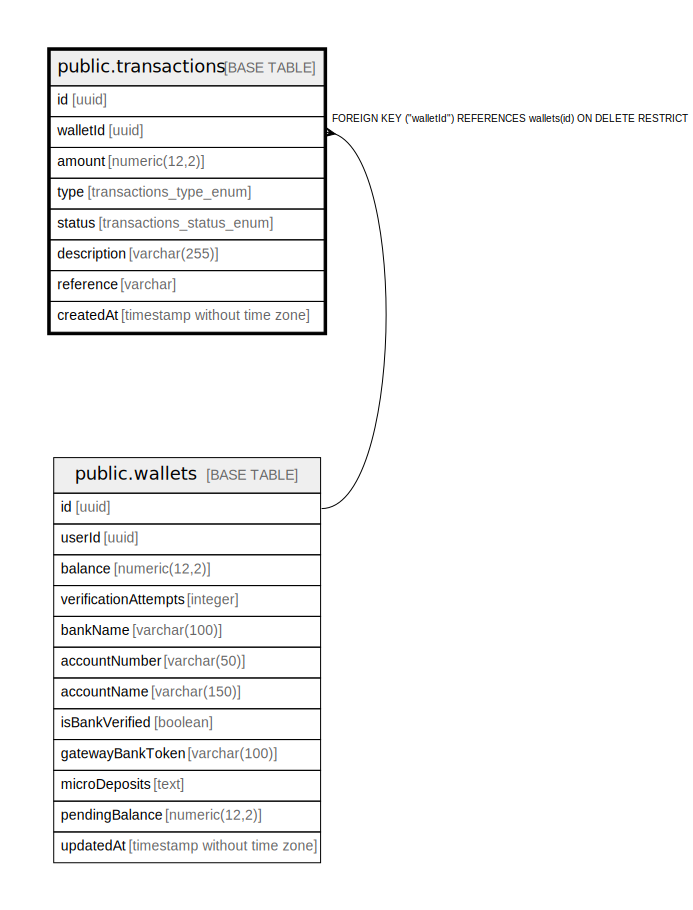

# public.transactions

## Columns

| Name | Type | Default | Nullable | Children | Parents | Comment |
| ---- | ---- | ------- | -------- | -------- | ------- | ------- |
| id | uuid | uuid_generate_v4() | false |  |  |  |
| walletId | uuid |  | false |  | [public.wallets](public.wallets.md) |  |
| amount | numeric(12,2) | '0'::numeric | false |  |  |  |
| type | transactions_type_enum |  | false |  |  |  |
| status | transactions_status_enum | 'SUCCESS'::transactions_status_enum | false |  |  |  |
| description | varchar(255) |  | true |  |  |  |
| reference | varchar |  | false |  |  |  |
| createdAt | timestamp without time zone | now() | false |  |  |  |

## Constraints

| Name | Type | Definition |
| ---- | ---- | ---------- |
| PK_a219afd8dd77ed80f5a862f1db9 | PRIMARY KEY | PRIMARY KEY (id) |
| UQ_dd85cc865e0c3d5d4be095d3f3f | UNIQUE | UNIQUE (reference) |
| FK_a88f466d39796d3081cf96e1b66 | FOREIGN KEY | FOREIGN KEY ("walletId") REFERENCES wallets(id) ON DELETE RESTRICT |

## Indexes

| Name | Definition |
| ---- | ---------- |
| PK_a219afd8dd77ed80f5a862f1db9 | CREATE UNIQUE INDEX "PK_a219afd8dd77ed80f5a862f1db9" ON public.transactions USING btree (id) |
| UQ_dd85cc865e0c3d5d4be095d3f3f | CREATE UNIQUE INDEX "UQ_dd85cc865e0c3d5d4be095d3f3f" ON public.transactions USING btree (reference) |
| IDX_dd85cc865e0c3d5d4be095d3f3 | CREATE UNIQUE INDEX "IDX_dd85cc865e0c3d5d4be095d3f3" ON public.transactions USING btree (reference) |

## Relations

---

> Generated by [tbls](https://github.com/k1LoW/tbls)
