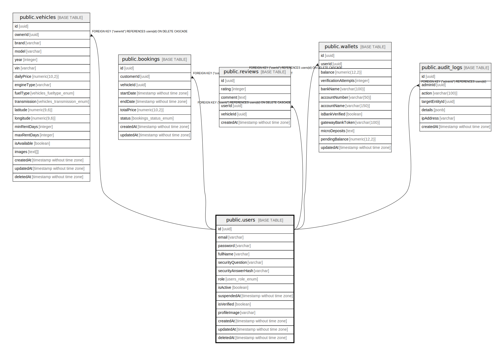

# public.users

## Columns

| Name | Type | Default | Nullable | Children | Parents | Comment |
| ---- | ---- | ------- | -------- | -------- | ------- | ------- |
| id | uuid | uuid_generate_v4() | false | [public.vehicles](public.vehicles.md) [public.bookings](public.bookings.md) [public.reviews](public.reviews.md) [public.wallets](public.wallets.md) [public.audit_logs](public.audit_logs.md) |  |  |
| email | varchar |  | false |  |  |  |
| password | varchar |  | true |  |  |  |
| fullName | varchar |  | false |  |  |  |
| securityQuestion | varchar |  | true |  |  |  |
| securityAnswerHash | varchar |  | true |  |  |  |
| role | users_role_enum | 'CUSTOMER'::users_role_enum | false |  |  |  |
| isActive | boolean | true | false |  |  |  |
| suspendedAt | timestamp without time zone |  | true |  |  |  |
| isVerified | boolean | false | false |  |  |  |
| profileImage | varchar |  | true |  |  |  |
| createdAt | timestamp without time zone | now() | false |  |  |  |
| updatedAt | timestamp without time zone | now() | false |  |  |  |
| deletedAt | timestamp without time zone |  | true |  |  |  |

## Constraints

| Name | Type | Definition |
| ---- | ---- | ---------- |
| PK_a3ffb1c0c8416b9fc6f907b7433 | PRIMARY KEY | PRIMARY KEY (id) |
| UQ_97672ac88f789774dd47f7c8be3 | UNIQUE | UNIQUE (email) |

## Indexes

| Name | Definition |
| ---- | ---------- |
| PK_a3ffb1c0c8416b9fc6f907b7433 | CREATE UNIQUE INDEX "PK_a3ffb1c0c8416b9fc6f907b7433" ON public.users USING btree (id) |
| UQ_97672ac88f789774dd47f7c8be3 | CREATE UNIQUE INDEX "UQ_97672ac88f789774dd47f7c8be3" ON public.users USING btree (email) |
| IDX_97672ac88f789774dd47f7c8be | CREATE UNIQUE INDEX "IDX_97672ac88f789774dd47f7c8be" ON public.users USING btree (email) |
| IDX_ace513fa30d485cfd25c11a9e4 | CREATE INDEX "IDX_ace513fa30d485cfd25c11a9e4" ON public.users USING btree (role) |

## Relations

---

> Generated by [tbls](https://github.com/k1LoW/tbls)
