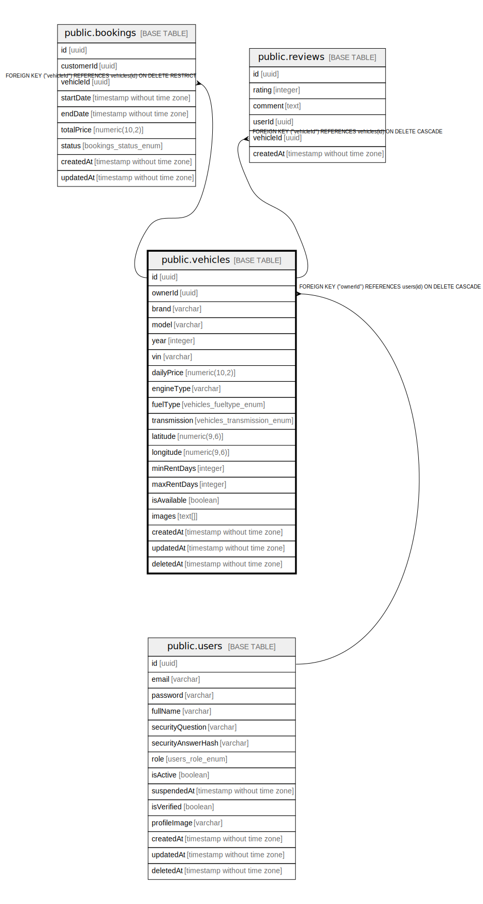

# public.vehicles

## Columns

| Name | Type | Default | Nullable | Children | Parents | Comment |
| ---- | ---- | ------- | -------- | -------- | ------- | ------- |
| id | uuid | uuid_generate_v4() | false | [public.bookings](public.bookings.md) [public.reviews](public.reviews.md) |  |  |
| ownerId | uuid |  | false |  | [public.users](public.users.md) |  |
| brand | varchar |  | false |  |  |  |
| model | varchar |  | false |  |  |  |
| year | integer |  | false |  |  |  |
| vin | varchar |  | false |  |  |  |
| dailyPrice | numeric(10,2) |  | false |  |  |  |
| engineType | varchar | 'V6 3.0L'::character varying | false |  |  |  |
| fuelType | vehicles_fueltype_enum | 'PETROL'::vehicles_fueltype_enum | false |  |  |  |
| transmission | vehicles_transmission_enum | 'AUTOMATIC'::vehicles_transmission_enum | false |  |  |  |
| latitude | numeric(9,6) |  | true |  |  |  |
| longitude | numeric(9,6) |  | true |  |  |  |
| minRentDays | integer | 1 | false |  |  |  |
| maxRentDays | integer | 30 | false |  |  |  |
| isAvailable | boolean | true | false |  |  |  |
| images | text[] | '{}'::text[] | false |  |  |  |
| createdAt | timestamp without time zone | now() | false |  |  |  |
| updatedAt | timestamp without time zone | now() | false |  |  |  |
| deletedAt | timestamp without time zone |  | true |  |  |  |

## Constraints

| Name | Type | Definition |
| ---- | ---- | ---------- |
| FK_c0a0d32b2ae04801d6e5b9e5c80 | FOREIGN KEY | FOREIGN KEY ("ownerId") REFERENCES users(id) ON DELETE CASCADE |
| PK_18d8646b59304dce4af3a9e35b6 | PRIMARY KEY | PRIMARY KEY (id) |
| UQ_8288ce015b69c5856cf54e07a67 | UNIQUE | UNIQUE (vin) |

## Indexes

| Name | Definition |
| ---- | ---------- |
| PK_18d8646b59304dce4af3a9e35b6 | CREATE UNIQUE INDEX "PK_18d8646b59304dce4af3a9e35b6" ON public.vehicles USING btree (id) |
| UQ_8288ce015b69c5856cf54e07a67 | CREATE UNIQUE INDEX "UQ_8288ce015b69c5856cf54e07a67" ON public.vehicles USING btree (vin) |
| IDX_2af2b1382c2b8ecbbd77792319 | CREATE INDEX "IDX_2af2b1382c2b8ecbbd77792319" ON public.vehicles USING btree (brand) |
| IDX_8288ce015b69c5856cf54e07a6 | CREATE UNIQUE INDEX "IDX_8288ce015b69c5856cf54e07a6" ON public.vehicles USING btree (vin) |
| IDX_6bc75a5d53f09bc444994e5588 | CREATE INDEX "IDX_6bc75a5d53f09bc444994e5588" ON public.vehicles USING btree ("engineType") |

## Relations

---

> Generated by [tbls](https://github.com/k1LoW/tbls)
