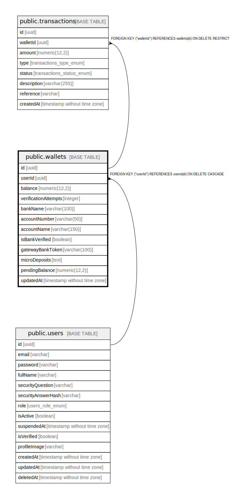

# public.wallets

## Columns

| Name | Type | Default | Nullable | Children | Parents | Comment |
| ---- | ---- | ------- | -------- | -------- | ------- | ------- |
| id | uuid | uuid_generate_v4() | false | [public.transactions](public.transactions.md) |  |  |
| userId | uuid |  | false |  | [public.users](public.users.md) |  |
| balance | numeric(12,2) | '0'::numeric | false |  |  |  |
| verificationAttempts | integer | 0 | false |  |  |  |
| bankName | varchar(100) |  | true |  |  |  |
| accountNumber | varchar(50) |  | true |  |  |  |
| accountName | varchar(150) |  | true |  |  |  |
| isBankVerified | boolean | false | false |  |  |  |
| gatewayBankToken | varchar(100) |  | true |  |  |  |
| microDeposits | text |  | true |  |  |  |
| pendingBalance | numeric(12,2) | '0'::numeric | false |  |  |  |
| updatedAt | timestamp without time zone | now() | false |  |  |  |

## Constraints

| Name | Type | Definition |
| ---- | ---- | ---------- |
| FK_2ecdb33f23e9a6fc392025c0b97 | FOREIGN KEY | FOREIGN KEY ("userId") REFERENCES users(id) ON DELETE CASCADE |
| PK_8402e5df5a30a229380e83e4f7e | PRIMARY KEY | PRIMARY KEY (id) |
| UQ_2ecdb33f23e9a6fc392025c0b97 | UNIQUE | UNIQUE ("userId") |

## Indexes

| Name | Definition |
| ---- | ---------- |
| PK_8402e5df5a30a229380e83e4f7e | CREATE UNIQUE INDEX "PK_8402e5df5a30a229380e83e4f7e" ON public.wallets USING btree (id) |
| UQ_2ecdb33f23e9a6fc392025c0b97 | CREATE UNIQUE INDEX "UQ_2ecdb33f23e9a6fc392025c0b97" ON public.wallets USING btree ("userId") |

## Relations

---

> Generated by [tbls](https://github.com/k1LoW/tbls)
